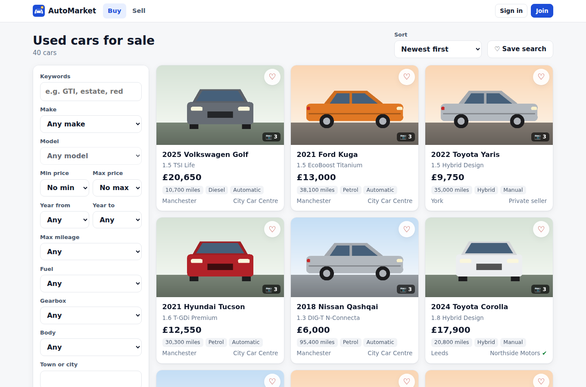
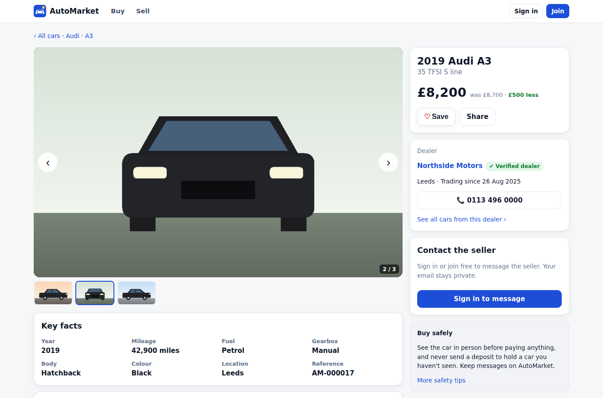
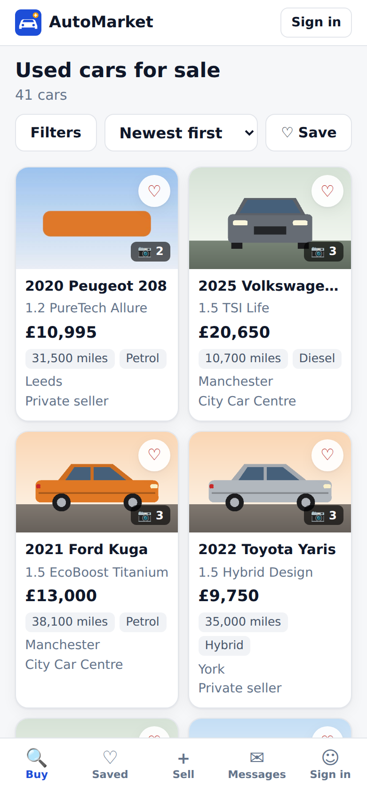
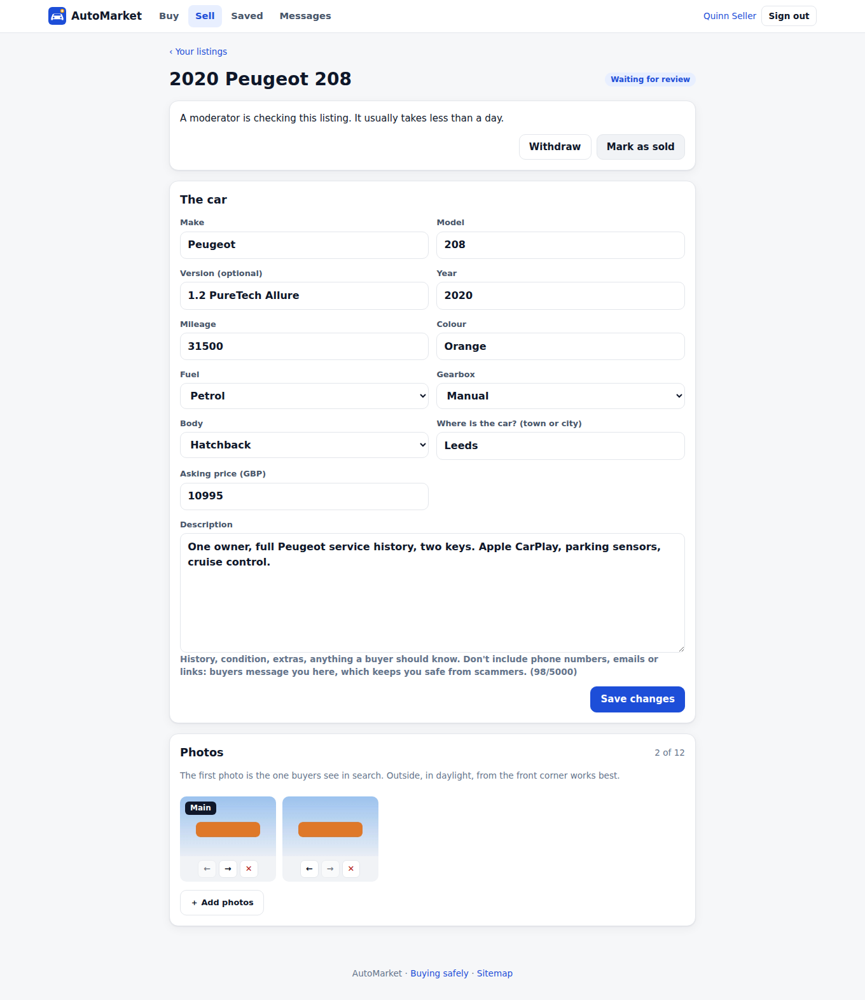
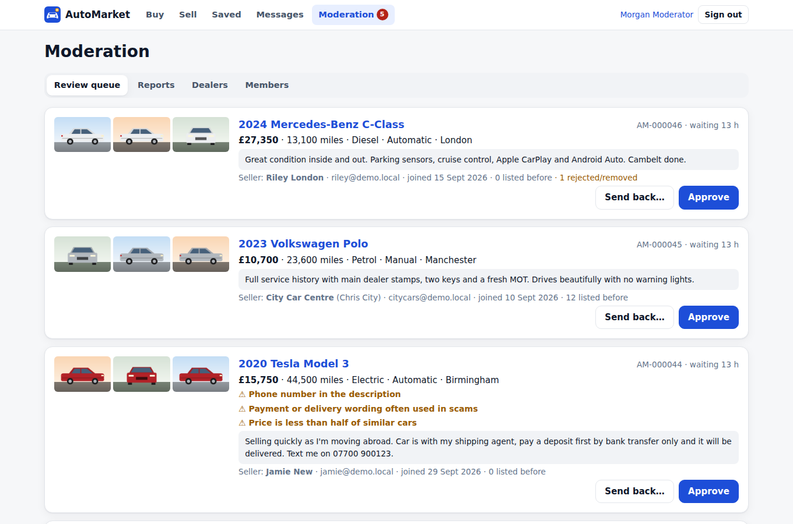
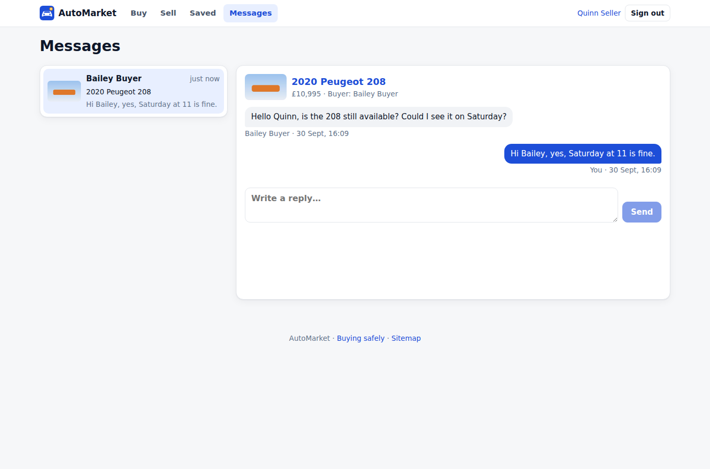
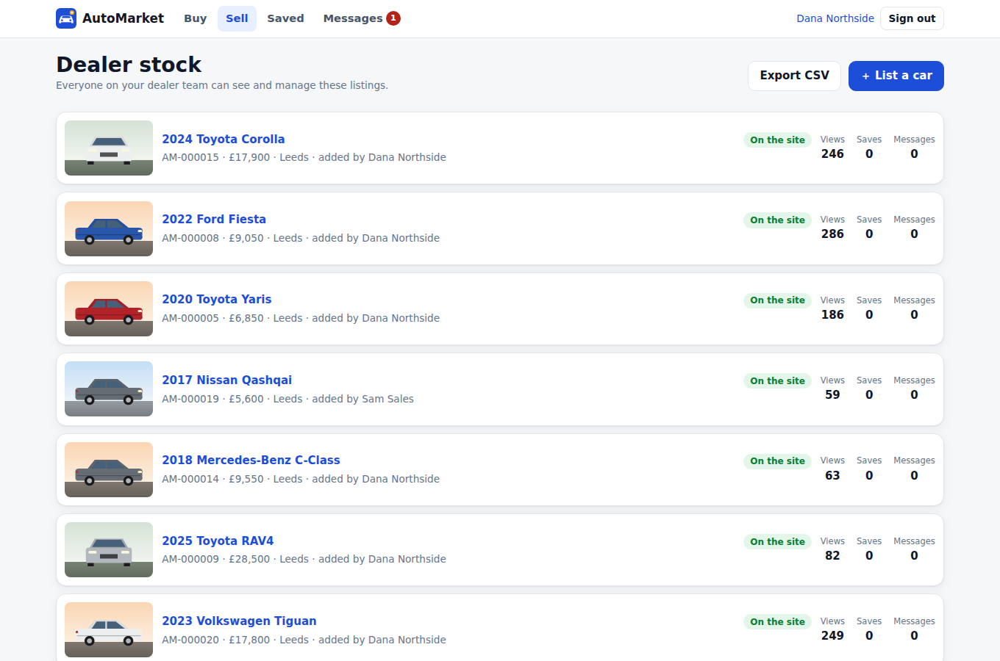

# Automotive Marketplace

A used-car marketplace where **dealers and private sellers** list cars, and **buyers** search, save cars and searches, and message sellers without sharing their email. **Moderators** keep scams off the site. It installs on phones as an app (PWA) and still shows recently viewed cars offline.



## What it does

**Buyers**
- Search by keyword, make and model (the lists show only what's on the site, with counts), price, year, mileage, fuel, gearbox, body, town and seller type. There are five sort orders, and every search is a shareable URL.
- Car pages have a photo gallery (arrow keys or large previous/next buttons), key facts, price cuts ("was £8,700 · £500 less"), and the seller's details: dealers show their phone number and a page of their stock, private sellers only their first name.
- Save cars (♥). **Save a search**: the app counts new matching cars since you last looked, with a badge on *Saved*.
- **Messages:** one conversation per car, with unread counts on both sides. Your email is never shown to the seller.
- **Report** a listing (scam, wrong details, sold, offensive, duplicate).

**Sellers**
- Listing a car takes a draft, the details, up to 12 photos and a submit. **Photos are resized in the browser** (to 1600 px, with a 480 px thumbnail), so uploads from a phone are quick. You can reorder photos, and the first one is the search picture.
- Your listings show views, saves and conversations, plus a CSV export. You can edit, mark as sold, withdraw and relist, and renew (listings expire after 60 days by default).
- **Private sellers** can list 3 cars at once (configurable).
- **Dealer accounts** have a business name, phone, public dealer page and a team: everyone on the team manages the dealer's cars and messages. Removing someone from the team removes their access, even to the cars they typed in.

**Moderation**
- **Review queue:** listings from private sellers and unverified dealers wait for a moderator, with the seller's history alongside. *Approve*, or *Send back* with a reason the seller sees.
- **Automatic warning signs** send even a verified dealer's listing to review. The signs are:
  - phone numbers, emails or links in the description;
  - deposit, shipping-agent or gift-card wording;
  - a price under half the median of comparable live cars (same make and model, ±2 years, when there are at least 5);
  - no photos.
- **Changes after approval are checked:** an approved listing edited to include any of these, or given new photos by a seller who needs review, goes back to the queue.
- **Reports:** reports from **3 different members** take a listing off the site until a moderator looks at it. You can dismiss a report or remove the listing; removing closes every report on it, and the seller can't put it back.
- **Dealers:** mark a dealer verified, which skips the queue, or suspend one, which hides all their cars.
- **Members:** suspend a member (signs them out and hides their cars) or restore them. Only admins change roles.
- **Everything is in the activity log**, including logins, failed logins and settings changes.

**Spam and abuse brakes**
- Sign-ups: 5 per hour per address.
- New conversations: 20 per member per day (configurable).
- Messages: 30 a minute. Reports: 10 an hour.
- General API limit: per signed-in session, or per IP for visitors.

**Phone app (PWA)**
- **Installable:** manifest, maskable icons, shortcuts ("Sell a car", "Messages", "Saved") and an "Install app" button where the browser offers it.
- **Offline:**
  - the service worker keeps the app shell, the public search and car pages you've opened, and their photos;
  - private data (messages, your listings, moderation) is never cached;
  - cached answers are cleared on sign-out.
- **Layout:** a bottom tab bar on phones, folding filters, and no sideways scrolling (checked by the smoke test at 390 px).

**Search engines:** `sitemap.xml` covers every live car and dealer page. `robots.txt` lets crawlers read the public API the pages are built from, and keeps them out of private pages.

| Car page | Phone | Listing a car |
| --- | --- | --- |
|  |  |  |

| Moderation | Messages | Dealer stock |
| --- | --- | --- |
|  |  |  |

## Run it

```bash
cp .env.example .env            # set POSTGRES_PASSWORD and PUBLIC_URL
docker compose up -d --build
docker compose exec app node dist/cli/create-admin.js --email you@example.com --name "Your Name"
```

**Demo data:** run `docker compose exec -e ALLOW_DEMO_SEED=1 app node dist/cli/seed-demo.js`. It loads two dealers, several private sellers, about 50 cars with drawn pictures, conversations, saved searches, a report, and a review queue that includes an obvious scam. Every demo account uses the password `demo-password-1`.

| Email | Who |
| --- | --- |
| `buyer@demo.local` | A buyer with saved cars, saved searches and conversations |
| `seller@demo.local` | A private seller |
| `dealer@demo.local` / `sales@demo.local` | Owner / staff of Northside Motors (verified) |
| `citycars@demo.local` | Owner of City Car Centre (not verified yet) |
| `mod@demo.local` | Moderator |
| `admin@demo.local` | Admin |

**Development** (Node 22, PostgreSQL 16): `npm install`, set `DATABASE_URL`, then `npm run migrate && npm run seed:demo && npm run dev`. The service worker is only registered in production builds.

Operations are covered in [docs/OPERATIONS.md](docs/OPERATIONS.md): deploying, https, backups, photo storage and moderation routines.

## How it's built

- **Stack:** Fastify 5 and PostgreSQL 16; React 19, React Router and TanStack Query; one Docker image. Photos are stored in PostgreSQL (`bytea`), so a database backup is complete. Moving them to object storage is described in the operations guide.
- **Search:** filters are bound parameters, and free text uses a generated `tsvector` with a GIN index. Every sort order ends on the id, so pages never overlap. Suspended sellers and expired listings are filtered out in one shared SQL fragment used by search, car pages, photos, favourites and the sitemap.
- **Security:**
  - Passwords are hashed with scrypt, and repeated failures lock the account.
  - Sessions are stored as hashes, with a CSRF token and an origin check.
  - Helmet CSP is on.
  - **Uploads:** the file type is checked from the file's first bytes, not the header; there are size and count limits; photos of hidden listings are served only to their owner and staff.
  - **Ownership:** it is checked on every listing, photo and conversation request, and other people's items answer 404.
  - CSV exports are protected against formula injection.
  - Dealer websites are linked with `nofollow ugc noopener`.
- **Integrity:**
  - optimistic locking on listings, so two editors can't overwrite each other;
  - status changes happen under row locks;
  - limits are checked under a lock, so two quick clicks can't pass them together;
  - the database enforces one conversation per buyer and car, and one open report per person and listing.

## Tests

- `npm test` runs three sets:
  - **15 unit tests** for the warning signs (including mileage and engine sizes that must *not* look like phone numbers), filters and listing rules;
  - **14 web tests** for prices, dates, photo sizing and search URLs;
  - **34 API tests on PostgreSQL** covering:
    - search filters, paging and injection attempts;
    - hidden listings and their photos;
    - sign-up and its rate limit, and CSRF;
    - the draft → review → live path, rejection and resubmission;
    - upload checks: fake images, wrong types, too many, too large;
    - the private-seller cap, verified dealers and warning signs, price cuts and optimistic locking;
    - dealer teams, including removed staff losing access;
    - conversations and unread counts, and the daily contact limit;
    - saved searches;
    - the three-report hold, suspensions, and role permissions;
    - sold, expiry and renewal, relisting;
    - CSV injection and per-session rate limits.
- `npm run smoke` starts the built server on a fresh database and drives it in Chromium through 40 checks:
  - a visitor searching;
  - sign-up and listing a car with real photo uploads;
  - a moderator rejecting the scam and approving the new car;
  - a buyer saving and messaging, and the seller replying;
  - the dealer's CSV;
  - the phone layout;
  - the service worker, with the car page opened **offline**.
